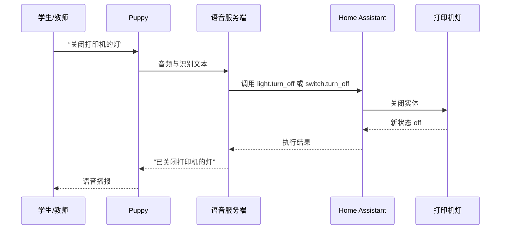
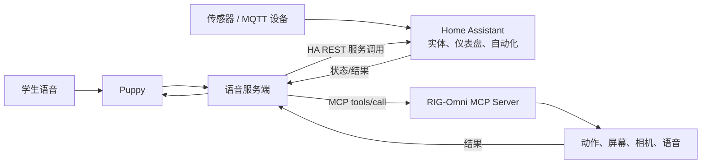

# Home Assistant 与 MCP：初中物联网和人工智能课程包

> 适用对象：初中七至九年级；建议 8 课，每课 90 分钟（也可拆为 16 个 45 分钟课时）。
>
> 资料版本：2026-09-02。本资料以本仓库当前代码为准，并对照 Home Assistant 与 MCP 官方文档。

## 先说结论：哪些是“已支持”，哪些是“课程扩展”

| 范围 | 当前状态 | 课堂定位 |
| --- | --- | --- |
| 自有平台的 HA 语音控制 | **需以平台后端核验**：Puppy 将语音交给平台；平台若已实现 HA 适配器，即可读取实体并调用 HA 服务 | 课程主线应是“关闭打印机的灯”；在平台接入已验证前不把它写成固件独立能力 |
| RIG-Omni 的 MCP 服务端 | **已实现（固件）**：设备端可发现、调用工具；支持 `initialize`、`tools/list`、`tools/call` | 第二主线：AI 让 Puppy 移动、拍照、显示信息或读取自身状态 |
| RIG-Omni 的 MQTT / WebSocket | **已实现（固件）**：Puppy 与语音服务端之间的通信 | 用于讲解联网、消息与远程控制；不是 HA MQTT Discovery 实现 |
| RIG-Omni 作为 HA 原生设备 | **未实现**：仓库未包含 HA integration、MQTT Discovery；`home_assistant_domain` 为空 | 不等于平台不能控制 HA；两者是不同层级 |
| Home Assistant 平台 | **可独立用于教学**：实体、设备、区域、仪表盘、自动化、MQTT 等 | 适合讲解“感知—判断—执行”的物联网系统 |

关键区分是：Puppy 的 **HA 控制应在自有平台服务端配置**，所以不能仅从本仓库判断平台已经支持哪些 HA 实体、授权方式或工具；固件的 **MCP** 则让平台可以进一步调用 Puppy 自己的工具。两条能力会由同一个语音对话协同，但执行目标不同。

## 一、教师技术速览

### 1. Home Assistant 应讲什么

Home Assistant 的设备集成会把设备能力表达为“实体（entity）”：例如温度、开关、门磁、灯光。教师可将“设备—实体—区域—仪表盘”理解成“教室—可观察/可控制的数据点—场地—可视化看板”。官方开发文档也将实体定义为对设备内部工作方式的抽象；例如灯、开关、传感器等标准实体拥有相应的控制动作。[设备与实体官方说明](https://developers.home-assistant.io/docs/architecture/devices-and-services/)

课堂最小知识集如下：

| 概念 | 初中生说法 | 可做的课堂例子 |
| --- | --- | --- |
| 设备（Device） | 一台真实物品 | 温湿度传感器、智能插座、机器人 |
| 实体（Entity） | 设备身上一个“能读或能控”的点 | `sensor.classroom_temperature`、`switch.fan` |
| 状态与属性 | 当前数值与附加说明 | 温度 28℃、最后更新时间 |
| 区域（Area） | 设备所在地点 | 教室、走廊、实验角 |
| 仪表盘（Dashboard） | 全班可看的控制台 | 温湿度曲线、开关按钮、告警卡片 |
| 自动化（Automation） | “如果……那么……”规则 | 温度超过阈值且上课中，就提示开窗 |
| MQTT | 设备之间的“班级广播频道” | 传感器发布读数，平台订阅后显示/触发规则 |

自动化的核心结构是 **触发器（Trigger）—条件（Condition，可选）—动作（Action）**；这是把生活语言转成程序规则的最佳入口。[Home Assistant 自动化基础](https://www.home-assistant.io/docs/automation/basics/)

建议的教学用 HA 能力范围：

1. 通过界面添加设备或演示实体，给实体命名并归入“教室”区域。
2. 创建一个仪表盘：至少有数值卡、历史图表卡、开关/按钮卡。
3. 用可视化编辑器创建 1 条自动化；先不要求学生写 YAML。
4. 进阶组使用模板，把动态温度、时间或状态填入通知文本。[模板官方入门](https://www.home-assistant.io/docs/templating/)
5. 进阶组使用 MQTT：理解主题（topic）、载荷（payload）、发布（publish）和订阅（subscribe），并查看 MQTT Explorer 或 HA 的 MQTT 调试界面。

Home Assistant 的 MQTT 集成可通过 Discovery 自动形成设备与实体，也支持手动/YAML 配置；这适合在传感器实验后引入“设备上报、平台订阅”的概念。[MQTT 官方文档](https://www.home-assistant.io/integrations/mqtt)

### 2. 自有平台怎样让 Puppy 通过语音控制 HA 中的打印机灯

这是自有平台应实现、也是本课程应优先演示的链路：



推荐在自有平台实现 **HA REST 适配器**：以长期访问令牌访问 `GET /api/states` 和 `GET /api/services`，将白名单内的可控实体转成给 LLM 的工具；对“关闭打印机的灯”执行 `POST /api/services/light/turn_off` 或 `switch/turn_off`，并带上目标 `entity_id`。Home Assistant 官方 REST API 明确提供实体状态、服务清单和服务调用端点。[HA REST API](https://developers.home-assistant.io/docs/api/rest/)

#### 把“打印机的灯”配置成能被准确控制的对象

1. 先在 HA 的“设置 → 设备与服务”中接入打印机灯对应设备；它必须是可控制实体，而不能只是只读传感器。
2. 在 HA 中为该实体设置简短、唯一、口语化的友好名称：**打印机的灯**。例如实体 ID 可为 `light.printer_light` 或 `switch.printer_light`；语音识别优先看友好名称。
3. 在 HA 开发者工具中手动执行一次对应服务，确认能关闭：`light.turn_off` 或 `switch.turn_off`，目标为该实体。
4. 在**自有平台**的 HA 连接配置中保存 HA 地址与长期访问令牌，执行“连接/发现设备”。平台应只向 LLM 暴露白名单中的“打印机的灯”。
5. 对 Puppy 说：**“关闭打印机的灯。”** 预期播报为执行成功，并在 HA 中看到状态从 `on` 变为 `off`。

> 若平台采用上述 REST 适配器，不需要在 HA 中额外安装 MCP Server 集成。若平台已经实现远程 MCP client，也可对接 HA 的 `/api/mcp`，但这是不同的实现路线，不能与 Puppy 固件的 MCP server 混为一谈。

#### 课堂故障排查卡

| 现象 | 首先检查 |
| --- | --- |
| 平台没有“打印机的灯” | 实体是否已接入 HA、是否可控制；检查平台的实体发现与白名单 |
| Puppy 听懂了但没有动作 | HA 地址是否被**自有平台后端**访问；长期访问令牌是否有效；查看平台/HA 日志 |
| 关闭了错误的灯 | 友好名称重名或太笼统；改成“打印机的灯”“讲台灯”等唯一名称 |
| 关灯成功但 Puppy 没播报 | 检查 Puppy 与自有平台的网络、会话状态和 TTS 回包 |

### 3. 当前 RIG-Omni MCP 到底支持什么

固件将自己实现为一个 **MCP server**，所使用的协议版本在源码中声明为 `2024-11-05`。它接收 JSON-RPC 2.0 请求，支持：

```text
initialize  → 声明 capabilities.tools 与设备信息
tools/list  → 取得工具清单（超出 8 KB 时用 nextCursor 分页）
tools/call  → 以名称和 JSON 参数调用某项设备能力
```

工具定义含名称、说明和 JSON Schema 风格的输入参数；整数可设范围，必填参数会验证。工具回调会排到设备主任务执行，减少直接并发控制硬件的风险。实现位置为 [`main/mcp_server.cc`](../../../main/mcp_server.cc) 与 [`main/mcp_server.h`](../../../main/mcp_server.h)。这与 MCP 官方对工具的定义一致：工具可被模型发现和调用，且应提供名称、说明与输入模式；敏感调用应保留人工确认。[MCP Tools 规范](https://modelcontextprotocol.io/specification/2026-07-28/server/tools)

本固件当前仅实现 **tools** 能力；没有实现 MCP 的 Resources、Prompts、授权协商等完整功能。因此课堂中应说“这是一个面向设备控制的轻量 MCP 服务端”，而非“完整 MCP 平台”。

#### 通用 MCP 工具（不同板型按硬件条件出现）

| 工具 | 作用 | 适合的教学点 |
| --- | --- | --- |
| `self.get_device_status` | 读取音频、屏幕、电池、网络等实时状态 | 传感器数据、先读后控 |
| `self.audio_speaker.set_volume` | 设置音量 0–100 | 参数范围、可访问性 |
| `self.screen.set_brightness` / `self.screen.set_theme` | 设置亮度/明暗主题 | 人机交互 |
| `self.camera.preview` | 拍照并显示 | 图像采集 |
| `self.camera.take_photo` | 拍照后提交问题进行识别/解释 | 计算机视觉与 AI 边界 |
| `self.set_power_mode` / `self.power_off` | 性能、平衡、省电模式；进入深度睡眠 | 能耗与边缘设备 |
| `self.set_language` | 切换 `zh-CN` / `en-US` | 多语言交互 |

另有默认不展示给 AI 的“用户专用”维护工具：`self.get_system_info`、`self.reboot`、`self.set_aec`、`self.upgrade_firmware`，以及在硬件/编译条件满足时出现的屏幕截图、图片预览、资源下载地址设置等工具。它们带有 `audience: ["user"]` 标记，适合向学生说明“普通控制”和“系统管理”必须分权。

#### 各机器人形态 MCP 工具

| 板型 | 当前工具组 | 可做的课堂任务 |
| --- | --- | --- |
| RIG-Puppy | `self.dog.move`、`self.dog.calibrate`、`self.dog.set_motor_angle`、`self.dog.action_loop`；15 个预设动作（Wave、Sit、Reset 等）；`self.laser.control`、`self.ble.remote_control` | 速度、方向、时间与安全距离；“把一句自然语言拆成参数” |
| RIG-Hover | `self.robot.head_angle`、`self.robot.move`、`self.robot.rotate`、`self.status.battery` | 平衡车移动、姿态、角度和电量 |
| RIG-Arm | `self.arm.x/y/z/yaw/pitch/roll`、`self.arm.teach_*`、预设动作、`self.arm.node/shake` | 坐标、关节、示教再现和动作编排 |
| RIG-Tars | `self.tars.set_personality`、`self.tars.forward`、`self.tars.turn`、`self.tars.calibrate`、`self.laser.control`、`self.ble.remote_control` | AI 人格参数、移动控制与安全规则 |
| RIG-Bot | 由通用工具与该板型编译配置决定 | 先用 `tools/list` 实测后再设计活动 |

> 安全提示：所有带实际运动、激光或固件升级的工具都应在教师演示或明确的安全边界内调用。学生任务优先选用状态读取、屏幕、音量、相机预览、低速度移动和模拟数据。

### 4. MCP 的初中版解释

把 MCP 比作“**AI 与工具之间的标准点单单**”：

```text
学生说：请机器人向前走 10 厘米
AI 判断：需要调用移动工具
MCP 工具单：self.robot.move({ "distance": 10 })
机器人执行：电机移动
工具结果：成功 / 失败 / 状态数据
```

可用这一活动区分三个角色：

- 人：提出目标、确认高风险操作、评价结果。
- AI：理解自然语言、选择工具、组织参数；它不是直接“拧电机”。
- 工具/设备：只按受约束的接口执行，返回可核验结果。

这也自然引出 AI 安全：工具描述和外部输入不等于可信指令；高风险工具要有最小权限、参数范围、人工确认和操作日志。MCP 官方规范同样要求服务端验证输入、实行访问控制、限流并清理输出，客户端则应在敏感调用前展示和确认输入。[MCP 工具安全要求](https://modelcontextprotocol.io/specification/2026-07-28/server/tools#security-considerations)

## 二、推荐课程大纲（8 × 90 分钟）

### 总体学习目标

学生完成课程后能够：

1. 画出一个物联网系统的“感知—网络—平台—决策—执行—反馈”闭环。
2. 在 Home Assistant 中辨认设备、实体、区域、仪表盘和自动化。
3. 用触发器—条件—动作表达至少一条有意义的自动化规则。
4. 解释 MCP 中“AI 选工具、工具按参数执行、结果返回”的流程。
5. 为机器人/智能教室设计有安全边界、有测试证据的 AI 方案。

| 课次 | 主题与核心问题 | 学生活动与作品 | 教师准备 |
| --- | --- | --- | --- |
| 1 | 智能教室是怎样“感知—判断—行动”的？ | 观察教室设备，画系统闭环图；区分传感器/执行器/平台/AI | 图片或实物：温湿度、灯、风扇、机器人 |
| 2 | Puppy 怎样说话控制 HA 设备？ | 将“打印机的灯”命名并验证；完成“关闭打印机的灯”语音测试 | 已接入 HA 的打印机灯、Puppy、自有平台 HA 适配器 |
| 3 | 如何做一个有用而不扰民的自动化？ | 写自然语言规则，再在 HA 创建“触发—条件—动作”；完成测试表 | 演示灯/虚拟开关/传感器数据 |
| 4 | MQTT 为什么像班级广播？ | 用主题卡片角色扮演发布/订阅；查看一条温度消息并解释 payload | MQTT Broker、HA MQTT 集成或模拟器 |
| 5 | AI 怎样真正操作 Puppy？ | 体验 `tools/list`，把 3 句指令改写成工具名和参数；调用低风险工具 | Puppy、可访问 MCP 客户端 |
| 6 | MCP 与 HA 各做什么？ | 对比“关闭打印机灯”和“让 Puppy 打招呼”两条工具链；完成路由卡 | 两张流程图、Puppy、HA 控制台 |
| 7 | 机器人动作如何做到可控和安全？ | 用距离、角度、速度、时间完成“走到指定点/做问候动作”；填写风险卡 | 划定运行区、急停/断电方案 |
| 8 | 项目展示与 AI 伦理 | 展示仪表盘、规则、工具卡与测试证据；互评“有用、安全、可解释” | 评分量规、展示计时器 |

每课可按 10 分钟情境引入、15 分钟概念与演示、45 分钟小组实践、15 分钟测试/分享、5 分钟退出卡组织。若只有 45 分钟，将每行拆成“概念演示”和“动手实践”两个课时。

## 三、贯穿项目：智能教室机器人助手

### 项目情境

教室在午后闷热、下课后设备可能未关闭、来访同学需要指引。请设计一个系统：看见教室状态、发出提示，并让机器人在得到人确认后完成迎宾或展示动作。

### 版本 A：不改固件即可完成（推荐）

1. Home Assistant 负责采集/展示教室环境，并创建“温度过高时提示”的自动化。
2. 将“打印机的灯”接入 HA；由自有平台配置 HA 连接，并成功完成“关闭打印机的灯”。
3. RIG-Omni 的 MCP 负责 Puppy 自身动作，如收到“下课展示”意图后调用 `self.dog.Wave`。
4. 学生用流程图区分 HA 设备控制与 Puppy 本体 MCP 工具调用，并写清楚哪些步骤由人确认。

### 版本 B：挑战任务（MCP 扩展）



此项目不要求改 Puppy 固件：HA 设备操作由**自有平台后端**调用 HA REST API，Puppy 本体操作走固件 MCP。自有平台需要实现或确认 HA 适配器的实体白名单、令牌保管、超时、错误回传和审计日志；扩展为“自动控制 Puppy”时还应限制距离/速度并保留人工确认。当前仓库的 MQTT 是既有设备通信协议，**不能**直接把 RIG 当作 HA MQTT Discovery 设备使用。

建议的桥接映射（仅用于设计作业，不代表当前已实现）：

| 语音意图或 HA 事件 | HA / MCP 调用 | 必须的保护 |
| --- | --- | --- |
| “关闭打印机的灯” | `light.turn_off` / `switch.turn_off`（HA） | 名称唯一；先在 HA 手动验证 |
| “请 Puppy 打招呼” | `self.dog.Wave` / `self.arm.node`（MCP） | 仅教师账号可用；运行区无人 |
| 课堂开始 | `self.screen.set_brightness`（MCP） | 亮度范围 20–80 |
| 电量低 | `self.get_device_status` 后通知（MCP） | 不自动移动；保留人工处理 |

## 四、课堂活动单（可直接打印）

### 活动 1：把一句话变成自动化

自然语言：**“如果教室温度超过 28℃，而且正在上课，就在仪表盘提示老师开窗。”**

请填写：

| 部分 | 你的答案 |
| --- | --- |
| 触发器：什么时候开始判断？ | 温度传感器状态变为 ______ |
| 条件：什么情况下才执行？ | ______ |
| 动作：系统做什么？ | ______ |
| 可能的误报？ | ______ |
| 如何测试？ | ______ |

### 活动 2：把一句话变成 MCP 工具调用

自然语言：**“机器人，向前走 10 厘米，然后打招呼。”**

| 步骤 | 工具名 | 参数 | 预期结果 | 安全检查 |
| --- | --- | --- | --- | --- |
| 1 | ______ | ______ | ______ | 运行区是否清空？ |
| 2 | ______ | ______ | ______ | 动作后是否停止？ |

提醒：先使用 `tools/list` 查看实际板型可用工具；Puppy、Hover、Arm、Tars 的工具名并不相同。

### 活动 3：AI 是否应该直接执行？

将下列任务标为“可自动执行 / 需要人确认 / 不允许”：

| 任务 | 判断 | 理由 |
| --- | --- | --- |
| 把屏幕亮度设为 60% |  |  |
| 让机器人在走廊快速移动 |  |  |
| 拍摄并识别同学的脸 |  |  |
| 关闭设备电源 |  |  |
| 打开激光装置 |  |  |

## 五、评价量规（100 分）

| 维度 | 优秀 | 达标 | 待改进 | 分值 |
| --- | --- | --- | --- | --- |
| 物联网理解 | 系统闭环完整，数据流与控制流清楚 | 能说清主要设备与自动化 | 概念混淆 | 25 |
| Home Assistant 作品 | 实体命名规范、仪表盘清晰、自动化经测试 | 完成基本仪表盘和 1 条规则 | 未能完成或无法解释 | 25 |
| MCP/AI 设计 | 工具和参数匹配，能说明 AI 与工具边界 | 能完成一次正确调用 | 只给自然语言，没有参数意识 | 20 |
| 安全、隐私与伦理 | 明确权限、确认、数据最小化与异常处理 | 能指出一项风险 | 忽略风险 | 20 |
| 协作与表达 | 分工明确，有测试记录和复盘 | 能完成小组展示 | 无作品证据 | 10 |

## 六、设备、网络与安全清单

### 最小可行配置

- 1 台部署 Home Assistant 的电脑/小主机，或教师录屏加模拟数据。
- 1 个温湿度/光照/人体感应设备；没有硬件时可用 HA Helper 或虚拟实体演示。
- 1 台可安全运行的 RIG-Omni 机器人；课前确认板型、固件版本和 `tools/list` 结果。
- 局域网、独立教学 Wi-Fi；不要把 MQTT Broker 或设备控制端口直接暴露到公网。
- 运行区胶带边界、低速模式、教师持有断电/急停方式。

### 上课前 10 分钟检查

1. 查看 Home Assistant 仪表盘是否能读到至少一个实体状态。
2. 在 HA 的自动化中用“手动运行”或模拟值测试一次，确认不会误触发真实高风险设备。
3. 确认 RIG 的电量、地面、活动空间；让学生站在边界外。
4. 执行 `tools/list`，以真实工具清单替换讲义中的板型示例。
5. 禁止学生调用固件升级、重启、关机、激光、未审核的相机识别或高速移动工具。

### 隐私底线

- 不采集、不展示学生人脸、姓名、声音等可识别信息；相机活动只拍物品或教师提供的教具。
- 若需要照片 AI 识别，先讲清“照片会发送到哪里、保存多久、谁能看到”，并取得学校允许。
- 使用教学专用账户和最小权限；不把 Token、Wi-Fi 密码或设备地址写在投影或提交作品中。

## 七、官方技术文档与延伸阅读

### Home Assistant

- [Home Assistant 文档总入口](https://www.home-assistant.io/docs/)：安装、仪表盘、自动化、模板和配置。
- [自动化基础](https://www.home-assistant.io/docs/automation/basics/)：触发器、条件、动作以及可视化编辑器。
- [MQTT 集成](https://www.home-assistant.io/integrations/mqtt)：Broker、Discovery、状态与可用性主题。
- [实体、设备与服务（开发者文档）](https://developers.home-assistant.io/docs/architecture/devices-and-services/)：解释设备能力如何映射为实体。
- [实体命名与自定义](https://www.home-assistant.io/docs/configuration/customizing-devices/)：适合教师统一命名规范。
- [REST API（开发者文档）](https://developers.home-assistant.io/docs/api/rest/)：自有平台发现实体、读取服务和执行 `turn_off` 的实现依据。

### Model Context Protocol

- [MCP Tools 规范](https://modelcontextprotocol.io/specification/2026-07-28/server/tools)：`tools/list`、`tools/call`、输入模式、结果与安全要求。
- [MCP 规范总入口](https://modelcontextprotocol.io/specification/)：了解协议版本与其他能力。

### 本仓库的对应源码

- [`main/mcp_server.cc`](../../../main/mcp_server.cc)：MCP 请求解析、工具列表与调用。
- [`main/mcp_server.h`](../../../main/mcp_server.h)：工具、参数与返回值的数据结构。
- [`main/boards/puppy/puppy_board.cc`](../../../main/boards/puppy/puppy_board.cc)：Puppy 工具注册示例。
- [`main/boards/hover/hover_board.cc`](../../../main/boards/hover/hover_board.cc)：Hover 移动/姿态/电量工具。
- [`main/boards/arm/arm_board.cc`](../../../main/boards/arm/arm_board.cc)：机械臂运动与示教工具。
- [`main/boards/tars/tars_board.cc`](../../../main/boards/tars/tars_board.cc)：Tars 人格与移动工具。
- [`main/protocols/mqtt_protocol.cc`](../../../main/protocols/mqtt_protocol.cc) 与 [`main/protocols/websocket_protocol.cc`](../../../main/protocols/websocket_protocol.cc)：设备通信实现。

## 八、教师容易混淆的三个问题

1. **“有 MQTT 就等于能接入 Home Assistant 吗？”** 不等于。MQTT 是传输协议；要成为 HA 可用设备，还需要符合 HA 的集成、实体或 MQTT Discovery 约定。当前 RIG 代码没有实现这层对接；但自有平台可以独立通过 HA REST API 控制已接入 HA 的设备。
2. **“MCP 是 AI 模型本身吗？”** 不是。MCP 是 AI 与外部工具交换“能做什么、怎么调用、结果是什么”的协议；模型、客户端、服务器和真实设备是不同角色。
3. **“AI 调用成功就说明系统安全了吗？”** 不说明。正确性还包括权限、参数上限、环境检查、超时、日志、隐私和人工确认。
